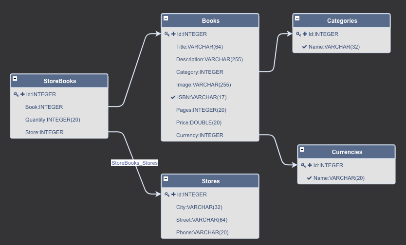

# Demo - EclipseCon 2018 - EDM

 

## Overview
Entity Data Model (EDM) for bookshop demo application:

 

### Dependencies:
- [bookshop-admin](https://github.com/dirigiblelabs/demo-eclipsecon2018-edm-bookshop-admin)
- [bookshop-data](https://github.com/dirigiblelabs/demo-eclipsecon2018-edm-bookshop-data)

## Access Points
- Bookshop Admin Page: [/services/v3/web/bookshop-admin/](http://localhost:8080/services/v3/web/bookshop-admin/)

## Related Demos
- [Bookshop - Marketplace](https://github.com/dirigiblelabs/demo-eclipsecon2018-edm-complex)
- [Bookshop - Print on Demand](https://github.com/dirigiblelabs/demo-eclipsecon2018-bpm)
